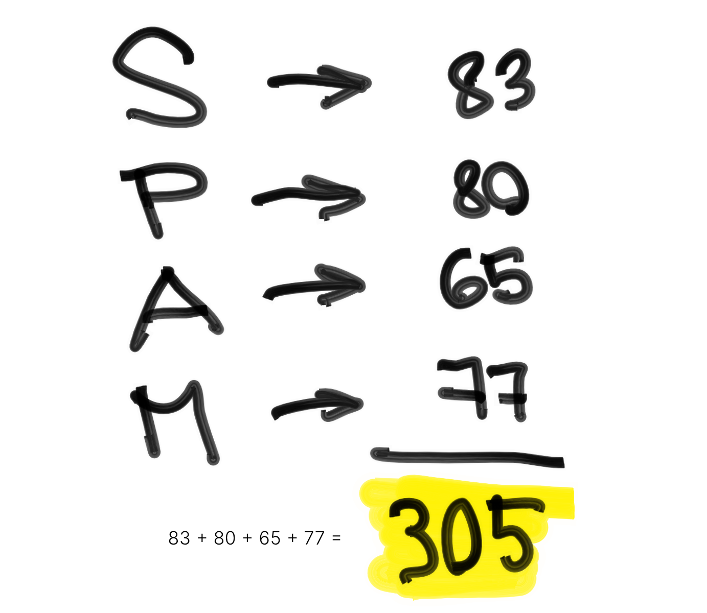
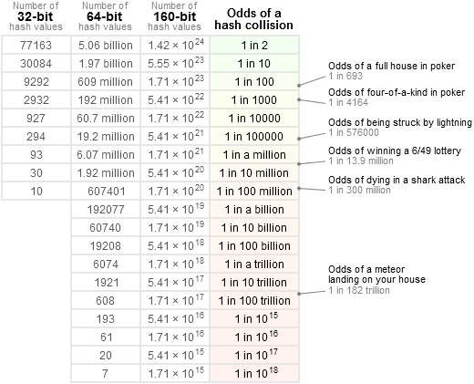

Let's say you have a string, such as `"SPAM"`, and you're trying to find if that string is contained in a list of a thousand other strings.

To do that, you'll <span name="only-unordered">need</span> to compare `"SPAM"` with as many as one thousand other strings. That's a lot of comparing.

<aside name="only-unordered">

**Aside:** Okay, okay, if the list of other strings is ordered in any way, then there's a lot less comparing to be done. Let's pretend that's not an option.

</aside>

To compare two strings without hashing, you have to go character by character. Only if each character is the same can we say the two strings are identical. 

```dart
/// Naive string comparison.
bool checkIdentical(String a, String b) {
  if (a.length != b.length) return false;
  for (var i = 0; i < a.length; i++) {
    if (a.codeUnits[i] != b.codeUnits[i]) {
      return false;
    }
  }
  return true;
}
```

That's a <span name="string-identity">lot of work</span>! Imagine comparing whole paragraphs of text to each other. If only we could simplify this!

<aside name="string-identity">

**Aside:** Comparing strings in most languages is as simple as `a == b`. The code here is therefore completely gratuitous, and only useful for explanation.

</aside>

## The idea

You know what's easy to compare? Numbers. In fact, comparing whether two numbers are identical is a single instruction for the CPU. That is to say, it's very fast. 

Could we represent these strings as numbers?

Well, each character is a number, right? For the computer, `A` is 65, `B` is 66, `C` is 67, and <span name="unicode-numbers">so on</span>. That's called the "char code"—the internal representation of a character in the computer's memory.

<aside name="unicode-numbers">

**Aside:** That's ASCII. The more modern encodings, like UTF-8, make this a little more complicated, but not by much. The 💩 (pile of poo) emoji is also a number — it's just a bit larger. (It's `0x1F4A9`, or 128,169 in decimal.) So it spans several bytes, but that doesn't really matter in our case. We'll just compare the bytes one by one.

</aside>

We could just take those numbers and use some mathematical formula to combine them into a single number.



And voilá: we have a way to encode a string of any length into a single number. That's hashing. For a given string (like `"SPAM"`), that number will always be the same (305), no matter who or when does the computation. That is to say, it's not a randomly assigned identification number: it can be recomputed at will.

<aside>

**Aside:** This is a good place to mention that when I say "numbers" here, I mean integers. Whole numbers, like 42 or 77. If we worked with fractional numbers (like 3.14 or 0.33333), there could be an element of unpredictability between different CPUs.

</aside>

```dart
/// Naive hashing function.
int hashString(String a) {
  var hash = 0;
  for (var character in a.codeUnits) {
    hash += character;
  }
  return hash;
}
```

Let's come back to our original example of checking if a long list of strings contains `"SPAM"` in it. We can hash each of the thousand strings, and so now we have a list of numbers. A list of _hash codes_. This new list of numbers takes a lot less space in memory, is easier to sort, and faster to work with.

Success!

## A small problem

Not so fast. Isn't it possible to have two different strings with the same hash? After all, a string can be arbitrarily long, while a simple integer cannot. 

In fact, with our naive hashing function above, the probability that there will be a _hash collision_ is high:

```dart
if (hashString("SPAM") == hashString("MAPS")) {
  // Uh oh!
}
```

Remember, we're just adding numbers together. Two plus three is the same as three plus two, which is the same as one plus four. Our program will not work as intended. It will insist that different strings are identical. Things will break.

This is why real hashing functions are a lot more involved than the naive one above. Even the simple CRC32 "checksum" is quite a few lines of bitwise operations and table lookups. The pseudocode for the popular SHA-1 hashing function is 46 lines long. 

Using _real_ hashing functions, the hash code of `"SPAM"` definitely isn't equal to the hash code of `"MAPS"`. Problem solved, right?

<!-- source: http://home.thep.lu.se/~bjorn/crc/ -->
<!-- source: https://en.wikipedia.org/wiki/SHA-1#SHA-1_pseudocode -->

Not so fast. Even with non-trivial hashing functions, there can be collisions. The probability is small, but it's there. Look at this table from Jeff Preshing's [blog](https://preshing.com/20110504/hash-collision-probabilities/):



No matter how great your hash function is, if it only produces 32-bit hash codes, and you have a list of 77,163 unique strings, the probability that two of the strings have the same hash code is 50%. That's not good.

Thankfully, hash functions that ship with modern programming languages use 64-bit hash values, and you'd need a list of over 5 _billion_ strings to reach the 50% chance of collision. And with cryptographic functions like the aforementioned SHA-1, you'd need over one _septillion_ (10<sup>24</sup>) strings. Which is a lot.


## Hashing is everywhere

If you're using a modern programming language, hashing is working for you all the time. When you compare two strings, like with `"spam" == "SPAM"`, that's done via hashing in the background. When you create a map (also known as 'dictionary' in some languages), chances are it's really a "hash map": the keys of the map are represented by their hash codes.

I explained hashing on strings, but it applies to any data. You can hash vectors, sets, arbitrary classes or booleans. You can even hash numbers!

<aside>

**Aside:** In programming languages, the hash code of 42 is just that: 42. But a hash of a huge number, like googol (10<sup>100</sup>) is something else than googol, because the hash code needs to fit into a normal-sized integer. Hash codes of fractional values (like 3.14) are different from the source number, because hash codes are whole numbers.

</aside>

If you've used git, you are probably aware of git commit hashes. Like this:

```text
$ git log
commit c2ae38f8a70d51dd003d137d4fff06f9eb4d1647
Author: Filip Hracek <some@example.com>
Date:   Thu Oct 29 11:46:33 2020 -0700

    Fix bug
```

That `c2ae38f8...` value is a hash code that uniquely identifies that commit. It's just a very big number, written in hexadecimal. In decimal, it's this:

> 1,111,429,502,104,458,606,634,325,828,610,920,458,897,444,378,183

The fact that git can <span name="shattered">describe any file</span>—and any state of your project—with just one number makes it fast and powerful. Hashing enables git to be what it is: a version management powerhorse.

<aside>

**Aside:** The reliance on hashing is of course also git's weakness. In 2017, a group of researchers was able to engineer two different PDF files with exactly the same SHA-1 hashcode. It took the equivalent of 6,500 years of single-CPU computations, so it wasn't easy. But it's possible, and it constitutes a security problem. (Learn more about this at [shattered.io](https://shattered.io/).)

</aside>

## The name

The reason we say "hashing" and "hash function" comes from the ordinary use of the words "hash".

When you hash potatoes, you chop them into tiny pieces and mix those pieces together. The structure of the original potatoes is lost, but they're all in that final product.

When you hash strings, you chop them into bytes and mix those bytes together into a single number. The structure of the original string is lost, but the bytes are all represented in the final product.

## Try it

Here's a challenge for you, if you're up to it. You have a class that represents a pair of integers: (x, y). Without researching the best approach on the internet, try to come up with a hash function. You're trying to make sure that (2, 3) has a different hash code from (3, 2), and that (1, 0) has a different hash code from (-1, 0) or (0, -1). It's harder than you may think. [Here](https://dartpad.dartlang.org/d8b08bf89580620ab18ff8983f105d8e)'s a DartPad for you.

As soon as you find a hashing function that looks promising, try to break it. Try to find two vectors that will result in the same hash code.